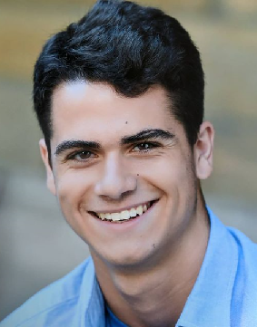
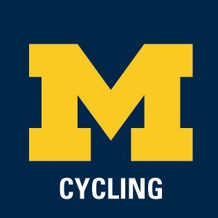
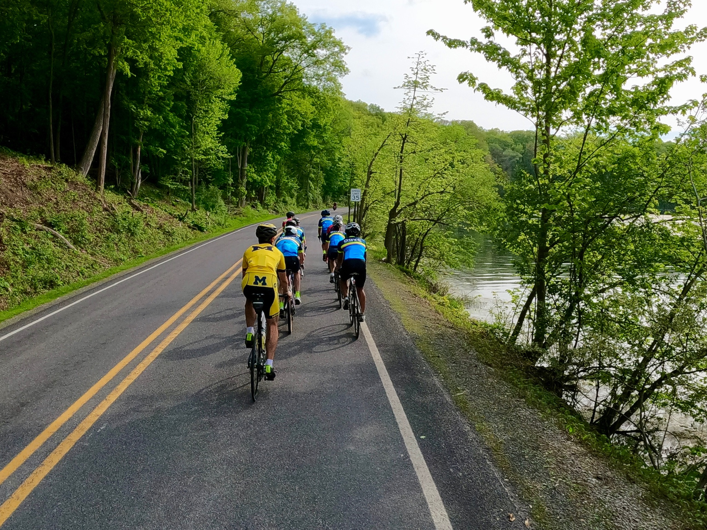
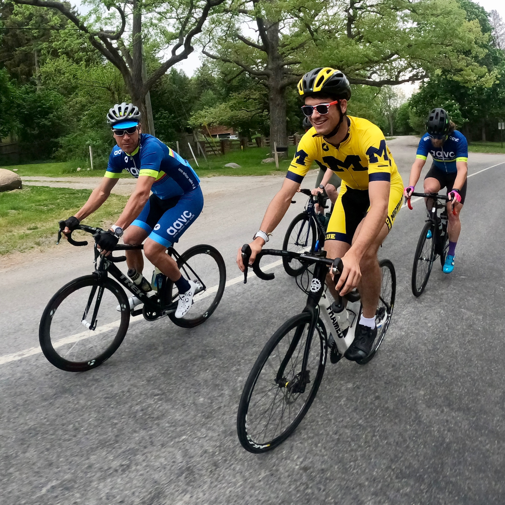

```{r setup, include=FALSE}
knitr::opts_chunk$set(echo = TRUE)
```

# About Me



Hello! I am a 20 year old UMich student who was born and raised in Ann Arbor with a love for sports and some healthy competition. During High school I competed regularly in track and cross-country, and split my time evenly between those, band, school, and boy scouts. Nowadays I spend a lot of time working on/enjoying my major and minor, working at the Molecular and Behavioral Neuroscience Institute, keeping in good shape for the UMich Collegiate Cycling team and eating up my free time with various side projects. On to the more serious stuff!

I tend to be challenge driven, meaning if I fall short of a goal on the first attempt I will continue to approach the problem from different angles until I have found a solution. Whether it's coming back from repeated injuries for the first two years of high school track, or restarting my eagle project out of frustration with my original sponsor, to transferring into the school of my dreams, I refuse to let my shortcomings make my decisions for me. Just recently in my first semester, I struggled immensely with my Discrete math coursework, and as a result had to retake the class following semester. In the spirit of reproaching the problem I enrolled in an additional course in probability, and thanks to that I have all but cemented my understanding of the two courses and am eager to get back on track with my Major.

# Education

:::{.box1}
I currently study at the University of Michigan as a Computer Science & Engineering major and Mathematics minor. I have a burgeoning specialization in probability and machine learning, though that is little more than an interest at this time, with the intent to pursue those fields more as I grow farther afield. I first began my college experience at MSU, then transferred to UM upon completion of my first year at MSU.
:::

:::{.box2}
**UMICH GPA:** 3.30 | [Transcript](assets/files/transcript.pdf) | **MSU GPA** 3.89 | [MSU Transcript]() 

Relevant Coursework:
Upcoming in the 2021 academic year:

- [Foundations of Computer Science (EECS 376)](https://bulletin.engin.umich.edu/courses/eecs/)
- [Introduction to Computer Organization (EECS 370)](https://bulletin.engin.umich.edu/courses/eecs/)
- [Introduction to Algorithms (EECS 477)](https://bulletin.engin.umich.edu/courses/eecs/)- [Introduction to Artificial Intelligence (EECS 370)](https://bulletin.engin.umich.edu/courses/eecs/)

Completed:

- [Data Structures and Algorithms (EECS281)](https://bulletin.engin.umich.edu/courses/eecs/)
- [Programming and Introductory Data Structures (EECS280)](https://bulletin.engin.umich.edu/courses/eecs/)
- [Discrete Mathematics (EECS203)](https://bulletin.engin.umich.edu/courses/eecs/)
- [Multivariable & Vector Calculus (MATH215)](https://lsa.umich.edu/math/undergraduates/undergraduate-math-courses/200-level-math-courses.html)
- [Introduction to Differential Equations (MATH216)](https://lsa.umich.edu/math/undergraduates/undergraduate-math-courses/200-level-math-courses.html)
- [Applied Linear Algebra (MATH214)](https://lsa.umich.edu/math/undergraduates/undergraduate-math-courses/200-level-math-courses.html)
- [Introduction to Probability (MATH425)](https://lsa.umich.edu/math/undergraduates/undergraduate-math-courses/400-level-courses.html)
- [Introduction to Statistics and Data Analysis (STATS250)](https://lsa.umich.edu/stats/undergraduate-students/statistics-courses.html)
:::

:::{.box1}
As well as being a student of the College of Engineering, I am also a student athlete, competing regularly in cycling as a representative of the University of Michigan
:::

:::



## Experience

[Research has shown](https://www.youtube.com/watch?v=NWv1VdDeoRY) that having a growth mindset focused around putting in effort and challenging yourself is far more effective than focusing on being perceived as intelligent. This has always been my focus, and I believe that whether I'm working a summer job or in a professional environment, the most effective predictor of my success in that environment is the effort I've invested.

## Summer Jobs

:::{.box1}
I started working summers as a 17 year old to be able to be financially responsible of my own hobbies and trivial expenses. I began as a dishwasher, and continued for a few summers at that position. Most recently I have been working as a server at Avalon Cafe in Ann Arbor, and have been both very successful and very satisfied occupying that position.
Some noteworthy details:

- Completed training two days ahead of schedule
- Within my first week as an independent employee I was the top seller during a shift
- I've bolstered my interpersonal skills and grown some robust salesmenship skills within the first month at this position
:::

## Professional Experience
Though new to the workforce as a Computer Science student, I believe my time spent during summer jobs have prepared me well for the corporate aspects of employment. This has been reflected in my positions to date, and I am eager to continue my experience as a Computer Science Engineer.

:::{.box1}
***MBNI***

My professional work experience began here in Ann Arbor at the University of Michigan Molecular and Behavioral Neuroscience Institute, as a programming intern. I spent a year as an employee there, and I can say I've learned a great deal about linear regression and statistics in a very short amount of time at this position. Thanks to the work ethic I developed over the previous three working summers I was able to learn and apply that knowledge quickly and effectively. 

At this position I was the sole manager of longitudinal data sets of FitBit activity analytics. I worked under supervision to organize and present the data to the head of the lab, and will publish our findings to the American Journal of Psychiatry in the Fall after peer review.
:::

# Volunteer Work

During my High School years I spent a large chunk of my time doing volunteer work for a variety of organizations. Between the BSA, symphonic and marching band, National Honors Society, and track * XC teams, I committed over 500 hours of community service starting at age 12 with the BSA. Some notable inclusions to those are listed below.

- Serving as Senior Patrol Leader of my scout troop during the years of 2018-19. This position required years of leadership skills that I cultivated in lower positions, and some of the duties included planning events, assigning project leaders for service projects and troop outings, coordinating with a cabinet of patrol leaders and Assistant Senior Patrol Leaders to satisfy the goals of the adult leadership while also keeping the interests of the scouts a priority. This was often a tough challenge, as the adults tended to be very achievement-driven, which while important often clashed with the wishes of the scouts, who were there primarily to have a fun time, so compromise was key.
- Conducting the annual leaf raking day for the First Presbyterian Church of Ann Arbor for the years of 2018 and 2019. During these days about 20 or 30 scouts would work with church members to clear a surprising amount of leaves from their grounds. Notable challenges of this project included securing enough tools for everyone to use and to ensure that everyone wore the proper attire for raking wet leaves in the subzero temperatures of November.
- Helping lead a few Track and XC banquets and fundraisers during the years of 2018 and 2019. I worked in direct collaboration with team captains and coaches to prepare the end of the season banquets and helped to fundraise a team raffle to afford new team equipment in 2019.

## Eagle Scouts

:::{.box1}
In order to earn the rank of eagle scout, it was necessary to earn some 3 dozen merit badges focusing on anything from personal finance to lifesaving, and then finished with running my own service project. I chose to coordinate the construction of a brick sidewalk for local VFW 423. In order to accomplish this, I had to campaign local construction companies for the donation of bricks and peat gravel, and to fundraise for necessary tools and refreshments to benefit the volunteer scouts. Construction took two days to complete, and there were an additional dozen or so other days spent planning and insuring the walkway would stay in good shape after its completion. At the end of the project I presented it to the local Eagle Scouts Board of Reviews to get their approval for the project's completion.


:::

# Projects

I have spent countless hours working on a vast variety of projects, both of personal interest and professional interest (often with some significant overlap of the two). Each project dramatically improved my understanding of the intrinsic subject matter, and bettered my appreciation of those fields.

## Professionals
:::{.box1}
These projects have been completed under my employment at MBNI, and during my time as a student at UofM. Some are locked at the request of the EECS department, please reach out to me personally if you would like to see them. Pictured below are samples of my personal code along with their github repos

1. A disease tracking program that takes as input a list of names, dates, and genome sequences of a specific disease to track its spread [link](https://github.com/dokastho/s2021-p1-epidemiology)
2. An implementation of a hash table [link](https://github.com/dokastho/hash-table)
3. An algorithm to heuristically solve the knapsack problem [link](https://github.com/dokastho/knapsack-snapshot)
4. An implementation of a data type that I had no prior understanding of, namely a skip list [link](https://github.com/dokastho/skip-list)
5. A demonstration of the benefits of dynamic programming [link](https://github.com/dokastho/fib-dp-snapshot)
:::
## Hobbies
in no particular order

1. Building my own road bike. Purchased the parts secondhand with my savings in 2020 and built the bike from scratch. I use this bike now for training and soon for competitions across the US
2. Building my own server. Purchased the parts secondhand with my savings in 2017, did some basic motherboard pin repair and networked the second floor of my house to set up the server that this website is hosted on.
3. Hosting various web-based applications on the aforementioned server
4. Using the server for remote development using VSCode
5. Building some PC's over the years both for me and my friends, culminating in interesting stuff like [Hardline watercooling](https://www.avadirect.com/blog/hardline-liquid-cooling-a-pc/)
6. Donating food to a local homeless shelter after work instead of tossing it
7. Assembled, soldered and burned firmware into a mechanical keyboard

# Links

*[linkedin](https://www.linkedin.com/in/thomas-dokas-8a078a1b3/)* |
*[github](https://www.github.com/dokastho)*


